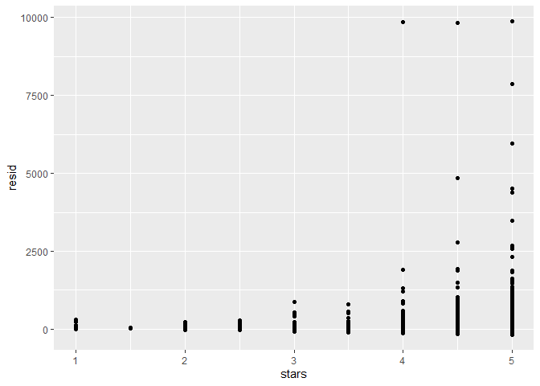
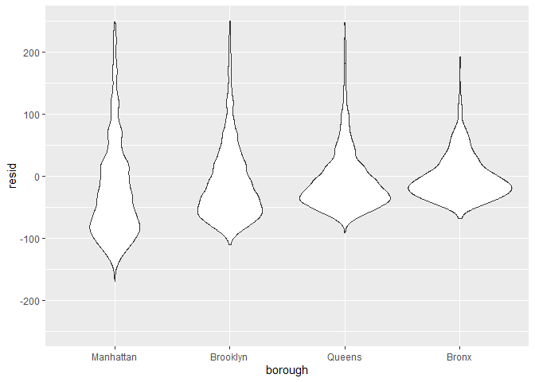

linear_models
================
yh3429
2022-11-10

``` r
library(tidyverse)
```

    ## ── Attaching packages ─────────────────────────────────────── tidyverse 1.3.2 ──
    ## ✔ ggplot2 3.3.6     ✔ purrr   0.3.4
    ## ✔ tibble  3.1.8     ✔ dplyr   1.0.9
    ## ✔ tidyr   1.2.0     ✔ stringr 1.4.1
    ## ✔ readr   2.1.2     ✔ forcats 0.5.2
    ## ── Conflicts ────────────────────────────────────────── tidyverse_conflicts() ──
    ## ✖ dplyr::filter() masks stats::filter()
    ## ✖ dplyr::lag()    masks stats::lag()

``` r
library(p8105.datasets)

set.seed(1)
```

## Model fitting

``` r
data("nyc_airbnb")

nyc_airbnb = 
  nyc_airbnb %>% 
  mutate(stars = review_scores_location / 2) %>% 
  rename(
    borough = neighbourhood_group,
    neighborhood = neighbourhood) %>% 
  filter(borough != "Staten Island") %>% 
  select(price, stars, borough, neighborhood, room_type)
```

``` r
fit = lm(price ~ stars + borough, data = nyc_airbnb)
```

``` r
nyc_airbnb = 
  nyc_airbnb %>% 
  mutate(
    borough = fct_infreq(borough),
    room_type = fct_infreq(room_type))

fit = lm(price ~ stars + borough, data = nyc_airbnb)
```

## Tidying output

``` r
summary(fit)
summary(fit)$coef
coef(fit)
fitted.values(fit)
```

### To get nicely format

``` r
fit %>% 
  broom::tidy() %>% 
  select(term, estimate, p.value) %>% 
  mutate(term = str_replace(term, "^borough", "Borough: ")) %>% 
  knitr::kable(digits = 3)
```

| term              | estimate | p.value |
|:------------------|---------:|--------:|
| (Intercept)       |   19.839 |   0.104 |
| stars             |   31.990 |   0.000 |
| Borough: Brooklyn |  -49.754 |   0.000 |
| Borough: Queens   |  -77.048 |   0.000 |
| Borough: Bronx    |  -90.254 |   0.000 |

#### Let’s chage reference category.

``` r
fit = 
  nyc_airbnb %>% 
  mutate (
    borough = fct_infreq(borough)      
  ) %>% 
  lm(price ~ stars + borough, data = .)

# the above steps want to change reference category #
# the reference group is the most common group #

fit %>% 
  broom::tidy() %>% 
  select(term, estimate, p.value) %>% 
  mutate(term = str_replace(term, "^borough", "Borough: ")) %>% 
  knitr::kable(digits = 2)
```

| term              | estimate | p.value |
|:------------------|---------:|--------:|
| (Intercept)       |    19.84 |     0.1 |
| stars             |    31.99 |     0.0 |
| Borough: Brooklyn |   -49.75 |     0.0 |
| Borough: Queens   |   -77.05 |     0.0 |
| Borough: Bronx    |   -90.25 |     0.0 |

``` r
fit %>% 
  broom::glance() %>% 
  select(AIC)
```

    ## # A tibble: 1 × 1
    ##       AIC
    ##     <dbl>
    ## 1 404237.

## Diagnostics

``` r
nyc_airbnb %>% 
  modelr::add_residuals(fit) %>% 
  ggplot(aes(x = stars, y = resid)) + geom_point()
```

    ## Warning: Removed 9962 rows containing missing values (geom_point).

<!-- -->

``` r
nyc_airbnb %>% 
  modelr::add_residuals(fit) %>% 
  ggplot(aes(x = borough, y = resid)) + geom_violin()+ylim(-250, 250)
```

    ## Warning: Removed 10862 rows containing non-finite values (stat_ydensity).

<!-- -->

## Hypothesis testing

#### one coefficient (let’s say one variable “stars”)

``` r
fit %>% 
  broom::tidy()
```

    ## # A tibble: 5 × 5
    ##   term            estimate std.error statistic   p.value
    ##   <chr>              <dbl>     <dbl>     <dbl>     <dbl>
    ## 1 (Intercept)         19.8     12.2       1.63 1.04e-  1
    ## 2 stars               32.0      2.53     12.7  1.27e- 36
    ## 3 boroughBrooklyn    -49.8      2.23    -22.3  6.32e-109
    ## 4 boroughQueens      -77.0      3.73    -20.7  2.58e- 94
    ## 5 boroughBronx       -90.3      8.57    -10.5  6.64e- 26

### more coefficients

``` r
fit_null = lm (price ~ stars, data = nyc_airbnb)
fit_alt = lm (price ~ stars+borough, data = nyc_airbnb)

anova(fit_null, fit_alt) %>% 
  broom::tidy()
```

    ## Warning: Unknown or uninitialised column: `term`.

    ## # A tibble: 2 × 7
    ##   term                    df.residual       rss    df   sumsq stati…¹    p.value
    ##   <chr>                         <dbl>     <dbl> <dbl>   <dbl>   <dbl>      <dbl>
    ## 1 price ~ stars                 30528    1.03e9    NA NA          NA  NA        
    ## 2 price ~ stars + borough       30525    1.01e9     3  2.53e7    256.  7.84e-164
    ## # … with abbreviated variable name ¹​statistic

## Room type by borough

#### Interaction…?

``` r
fit =
  nyc_airbnb %>% 
  lm (price ~ stars+borough * room_type, data = .) 

fit%>% broom::tidy()
```

    ## # A tibble: 13 × 5
    ##    term                                  estimate std.error statistic  p.value
    ##    <chr>                                    <dbl>     <dbl>     <dbl>    <dbl>
    ##  1 (Intercept)                              121.      11.8      10.3  1.01e-24
    ##  2 stars                                     21.8      2.42      8.97 3.06e-19
    ##  3 boroughBrooklyn                          -55.5      2.94    -18.9  2.81e-79
    ##  4 boroughQueens                            -86.7      5.66    -15.3  1.09e-52
    ##  5 boroughBronx                            -108.      14.9      -7.27 3.78e-13
    ##  6 room_typePrivate room                   -125.       2.99    -41.7  0       
    ##  7 room_typeShared room                    -154.       8.69    -17.7  9.81e-70
    ##  8 boroughBrooklyn:room_typePrivate room     32.4      4.31      7.51 5.97e-14
    ##  9 boroughQueens:room_typePrivate room       56.0      7.44      7.52 5.60e-14
    ## 10 boroughBronx:room_typePrivate room        71.6     18.0       3.98 7.03e- 5
    ## 11 boroughBrooklyn:room_typeShared room      48.1     13.9       3.46 5.34e- 4
    ## 12 boroughQueens:room_typeShared room        60.7     17.9       3.40 6.72e- 4
    ## 13 boroughBronx:room_typeShared room         85.4     42.4       2.01 4.41e- 2

#### so…can we fit models by borough…? (Here, for example, to have four different linear models by different four boroughs)

``` r
nest_lm_res =
  nyc_airbnb %>% 
  nest(data = -borough) %>% 
  mutate(
    models = map(data, ~lm(price ~ stars + room_type, data = .x)),
    results = map(models, broom::tidy)) %>% 
  select(-data, -models) %>% 
  unnest(results)

nest_lm_res
```

    ## # A tibble: 16 × 6
    ##    borough   term                  estimate std.error statistic   p.value
    ##    <fct>     <chr>                    <dbl>     <dbl>     <dbl>     <dbl>
    ##  1 Bronx     (Intercept)              90.1      15.2       5.94 5.73e-  9
    ##  2 Bronx     stars                     4.45      3.35      1.33 1.85e-  1
    ##  3 Bronx     room_typePrivate room   -52.9       3.57    -14.8  6.21e- 41
    ##  4 Bronx     room_typeShared room    -70.5       8.36     -8.44 4.16e- 16
    ##  5 Queens    (Intercept)              91.6      25.8       3.54 4.00e-  4
    ##  6 Queens    stars                     9.65      5.45      1.77 7.65e-  2
    ##  7 Queens    room_typePrivate room   -69.3       4.92    -14.1  1.48e- 43
    ##  8 Queens    room_typeShared room    -95.0      11.3      -8.43 5.52e- 17
    ##  9 Brooklyn  (Intercept)              69.6      14.0       4.96 7.27e-  7
    ## 10 Brooklyn  stars                    21.0       2.98      7.05 1.90e- 12
    ## 11 Brooklyn  room_typePrivate room   -92.2       2.72    -34.0  6.40e-242
    ## 12 Brooklyn  room_typeShared room   -106.        9.43    -11.2  4.15e- 29
    ## 13 Manhattan (Intercept)              95.7      22.2       4.31 1.62e-  5
    ## 14 Manhattan stars                    27.1       4.59      5.91 3.45e-  9
    ## 15 Manhattan room_typePrivate room  -124.        3.46    -35.8  9.40e-270
    ## 16 Manhattan room_typeShared room   -154.       10.1     -15.3  2.47e- 52

#### Quick double check

``` r
nyc_airbnb %>% 
  filter (borough == "Bronx") %>% 
  lm (price ~stars + room_type, data = .) %>% 
  broom::tidy()
```

    ## # A tibble: 4 × 5
    ##   term                  estimate std.error statistic  p.value
    ##   <chr>                    <dbl>     <dbl>     <dbl>    <dbl>
    ## 1 (Intercept)              90.1      15.2       5.94 5.73e- 9
    ## 2 stars                     4.45      3.35      1.33 1.85e- 1
    ## 3 room_typePrivate room   -52.9       3.57    -14.8  6.21e-41
    ## 4 room_typeShared room    -70.5       8.36     -8.44 4.16e-16

``` r
nyc_airbnb %>% 
  filter (borough == "Queens") %>% 
  lm (price ~stars + room_type, data = .) %>% 
  broom::tidy()
```

    ## # A tibble: 4 × 5
    ##   term                  estimate std.error statistic  p.value
    ##   <chr>                    <dbl>     <dbl>     <dbl>    <dbl>
    ## 1 (Intercept)              91.6      25.8       3.54 4.00e- 4
    ## 2 stars                     9.65      5.45      1.77 7.65e- 2
    ## 3 room_typePrivate room   -69.3       4.92    -14.1  1.48e-43
    ## 4 room_typeShared room    -95.0      11.3      -8.43 5.52e-17
